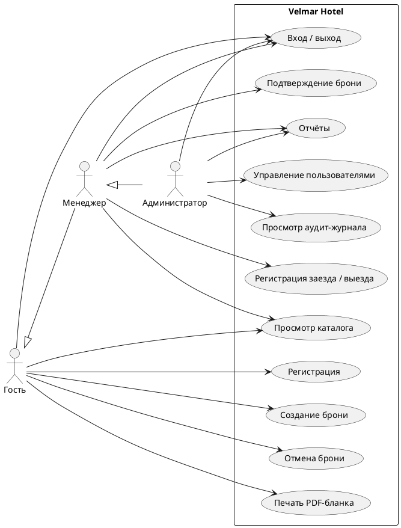
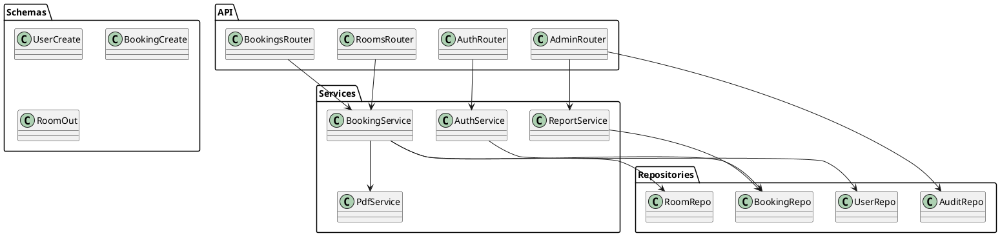

# Что осталось сделать для защиты курсового проекта

> Этот документ — пошаговый план оставшейся работы. Технический код, БД, сервер, клиент, тесты и markdown-документация уже готовы (≈100%). Осталась академическая упаковка: диаграммы, ПЗ в .docx, презентация, доклад и стандартные сопровождающие документы вуза. Готовность всего проекта — около **75–80%**.

**Ссылки:**
- Репозиторий: https://github.com/imooporos/hotel-management-system
- PR: https://github.com/imooporos/hotel-management-system/pull/1
- Сервер: http://77.221.151.85/ (Swagger: http://77.221.151.85/docs)

---

## Содержание

1. [Диаграммы и графическая часть (Приложение А)](#1-диаграммы-и-графическая-часть-приложение-а)
2. [Пояснительная записка (ПЗ)](#2-пояснительная-записка-пз)
3. [Аннотация](#3-аннотация)
4. [Ведомость](#4-ведомость)
5. [План-график (22 этапа)](#5-план-график-22-этапа)
6. [Презентация для защиты](#6-презентация-для-защиты)
7. [Доклад (текст выступления)](#7-доклад-текст-выступления)
8. [Отзыв научного руководителя](#8-отзыв-научного-руководителя)
9. [Чек-лист «что взять на защиту»](#9-чек-лист-что-взять-на-защиту)
10. [Безопасность — после сдачи](#10-безопасность--после-сдачи)
11. [Опциональные технические улучшения](#11-опциональные-технические-улучшения)

---

## 1. Диаграммы и графическая часть (Приложение А)

Преподаватель в задании явно требует **семь** артефактов:

| № | Что | Тип | Инструмент | Куда сохранить |
|---|---|---|---|---|
| A.1 | Функциональная модель IDEF0 (контекстная) | A-0 диаграмма | Ramus / draw.io (шаблон IDEF0) / Visio | `docs/diagrams/idef0_context.png` |
| A.2 | Декомпозиция IDEF0 | A0 диаграмма | то же | `docs/diagrams/idef0_decomposition.png` |
| A.3 | Use-case (диаграмма прецедентов) | UML | PlantUML / draw.io | `docs/diagrams/use_case.puml` + `.png` |
| A.4 | ER-модель (концептуальная) | Сущности и связи | draw.io / dbdiagram.io | `docs/diagrams/er_model.png` |
| A.5 | IDEF1x (логическая) | IDEF1x | ERwin / dbdiagram.io | `docs/diagrams/idef1x.png` |
| A.6 | Схема данных в СУБД (физическая) | Скрин из pgAdmin | pgAdmin → ERD-tool | `docs/diagrams/db_schema.png` |
| A.7 | Диаграмма классов (если применимо) | UML | PlantUML | `docs/diagrams/class_diagram.puml` + `.png` |

### 1.1 IDEF0 — что нарисовать

**Контекст (A-0):**
- Один блок: «Управление гостиницей» (Velmar Hotel).
- Входы (слева): запросы гостей, данные о номерах, заявки на бронирование.
- Управление (сверху): нормативные акты гостиничного бизнеса, политика ценообразования, правила RBAC.
- Механизмы (снизу): сотрудники гостиницы, ИТ-инфраструктура (PostgreSQL, FastAPI, Flet-клиент).
- Выходы (справа): подтверждённые бронирования, отчёты о выручке, PDF-бланки заказа, аудит-журнал.

**Декомпозиция (A0)** — 4–5 функций:
1. Аутентификация и авторизация пользователя
2. Управление каталогом номеров (CRUD)
3. Бронирование номера (расчёт + создание + проверка пересечений)
4. Регистрация заезда / выезда (менеджер)
5. Формирование отчётов (PDF, выручка, загрузка)

### 1.2 Use-case диаграмма

Акторы: **Гость**, **Менеджер**, **Администратор**, **Система**.

Прецеденты (минимум):
- Регистрация / Вход / Выход
- Просмотр каталога (с фильтрами)
- Создание бронирования
- Отмена бронирования
- Просмотр истории своих броней (только гость)
- Печать PDF-бланка заказа
- Подтверждение / отклонение брони (менеджер+)
- Регистрация заезда / выезда (менеджер+)
- Управление пользователями (админ)
- Просмотр аудит-журнала (админ)

Готовый PlantUML-шаблон уже подготовлен ниже — раздел [«Заготовки PlantUML»](#заготовки-plantuml).

### 1.3 ER-модель и IDEF1x

Сущности:
- `users`, `roles`, `guest_profiles`
- `room_categories`, `rooms`, `amenities`, `room_amenities`
- `services`
- `bookings`, `booking_services`
- `payments`
- `audit_log`

Связи (главные):
- `users 1—1 guest_profiles` (для роли guest)
- `users N—1 roles`
- `rooms N—1 room_categories`
- `rooms N—N amenities` через `room_amenities`
- `bookings N—1 users` (гость) и `bookings N—1 rooms`
- `bookings N—N services` через `booking_services`
- `payments N—1 bookings`

Самый быстрый способ: открыть **pgAdmin 4** → правый клик на схеме `public` → **ERD For Database** → экспортировать как PNG. Это покроет сразу A.4, A.5 и A.6.

### 1.4 Диаграмма классов

Минимум 4 уровня:
- **Layer: API (FastAPI routers)** — `AuthRouter`, `RoomsRouter`, `BookingsRouter`, `AdminRouter`.
- **Layer: Service / Domain** — `AuthService`, `BookingService`, `ReportService`, `PdfService`.
- **Layer: Repository** — `UserRepo`, `RoomRepo`, `BookingRepo`, `AuditRepo`.
- **Layer: Models / Schemas (Pydantic)** — `UserCreate`, `BookingCreate`, `RoomOut` и т. п.

### Заготовки PlantUML

Сохрани этот код в `docs/diagrams/use_case.puml` и отрендери на https://plantuml.com или в VSCode-плагине:



И заготовка диаграммы классов `docs/diagrams/class_diagram.puml`:



---

## 2. Пояснительная записка (ПЗ)

В задании явно перечислены 5 разделов. Для каждого ниже указано: **где брать готовый текст** + **что доделать**.

### Структура ПЗ (рекомендуемая, ~25–35 страниц)

#### Титульный лист, задание, аннотация — по шаблону вуза.

#### Введение (1–2 стр.)
- Актуальность темы: автоматизация управления гостиницей.
- Цель: разработать ИС для гостиницы с акцентом на использование возможностей PostgreSQL.
- Задачи: спроектировать БД, реализовать сервер и клиент, обеспечить защиту данных, протестировать.
- → **Источник**: задание + `README.md` § «Функционал».

#### 1. Постановка задачи (2–3 стр.)
- Описание предметной области (гостиничный бизнес).
- Функциональные требования (по ролям).
- Нефункциональные требования (защита, производительность, кросс-платформенность).
- → **Источник**: задание из чата + `README.md`.

#### 2. Проектирование БД (4–6 стр.)
- Концептуальная модель (ER-диаграмма из A.4).
- Логическая модель (IDEF1x из A.5).
- Физическая модель (схема из pgAdmin, A.6).
- Описание сущностей и связей.
- Обоснование выбора PostgreSQL (домены, исключающие констрейнты, RLS, GiST-индексы).
- → **Источник**: `docs/architecture.md` § «Слой данных» + `pg_scripts/03_tables.sql` (комментарии).

#### 3. Создание объектов БД (8–12 стр., самое объёмное)
Преподаватель будет проверять. По каждому объекту: имя, назначение, SQL-код, пример использования в приложении.

- **Домены** (3 штуки): `email_domain`, `phone_domain`, `positive_money` → `pg_scripts/02_domains_types.sql`.
- **Пользовательские типы (ENUM)** (2 штуки): `room_status`, `booking_status`.
- **Таблицы** (11): `pg_scripts/03_tables.sql`. Для каждой — назначение и связи.
- **Индексы** (12): `pg_scripts/04_indexes.sql`. Особо подчеркнуть GiST по `tsrange` для проверки пересечений.
- **Представления** (4): `pg_scripts/05_views.sql`. Для каждого — пример SQL и где используется в коде сервера.
  - `v_room_availability` — каталог номеров с признаком занятости.
  - `v_guest_bookings` — выборка броней с join'ами для UI.
  - `v_revenue_by_category` — отчёт «выручка по категориям».
  - `v_active_bookings` — активные брони для дашборда.
- **Функции** (3): `pg_scripts/06_functions.sql`.
  - `fn_room_is_free(room_id, from, to)` — проверка свободности номера.
  - `fn_calculate_booking_total(...)` — расчёт стоимости (используется в `/bookings/calculate`).
  - `fn_occupancy_rate(...)` — процент загрузки за период.
- **Процедуры** (5): `pg_scripts/07_procedures.sql`. По заданию нужны insert/update/delete/select + 1 «своя».
  - `sp_create_booking`, `sp_update_booking_status`, `sp_cancel_booking`, `sp_select_bookings_by_guest`, `sp_set_room_status`.
- **Триггеры** (5): `pg_scripts/08_triggers.sql`. Для каждого — `BEFORE/AFTER`, что делает, как используется приложением.
  - `trg_set_updated_at` — общий housekeeping.
  - `trg_no_overlap_booking` — главная защита от конфликтов броней.
  - `trg_update_room_status` — синхронизация статуса номера с активной бронью.
  - `trg_audit_bookings`, `trg_audit_users`, `trg_audit_rooms` — аудит-журнал.
- **Своё (домены/ограничения)** — упомянуть отдельно, преподаватель просит «1–2 шт.».
- **EXCLUDE-ограничение** — обязательно отдельно подчеркнуть как уникальную фичу PostgreSQL.
- **RLS-политики** (2): `pg_scripts/10_security.sql`. Гость видит только свои строки в `bookings`.
- **Пул запросов** (12 типов): `pg_scripts/09_queries_pool.sql`. По одному примеру каждого типа из задания (простые с условием, скалярные/табличные подзапросы, EXISTS/ALL, множественные операции, WITH, агрегатные с группировкой, многотабличные, строки/даты/преобразования, рекурсивные, перекрёстные, оконные).

> **Совет**: вставлять в ПЗ скриншоты выполнения запросов в pgAdmin или DBeaver — это очень нравится преподавателям.

#### 4. Проектирование и создание приложения (4–6 стр.)
- Архитектура: 3 слоя (БД, REST API, GUI). Диаграмма из `docs/architecture.md`.
- Стек: Python 3.13/3.12, FastAPI, asyncpg, JWT, bcrypt, Flet, ReportLab.
- Описание REST-эндпойнтов (можно списком или скрин Swagger).
- Дизайн клиента: токены темы, теплый teal-бренд, светлая/тёмная темы, без Material 3.
- → **Источник**: `docs/architecture.md`, `server/README.md`, `client/README.md`.

#### 5. Методы защиты данных (3–5 стр.)
- Хеширование паролей (bcrypt с cost factor ≥12).
- JWT-токены (HS256, 30 минут жизни, refresh-стратегия).
- RBAC на уровне приложения.
- RLS на уровне БД (пример SQL).
- Аудит-триггеры с фиксацией кто-что-когда менял.
- Защита от SQL-инъекций (параметризованные запросы asyncpg).
- Защита от XSS (Flet рендерит текст, не HTML).
- HTTPS-рекомендация (см. § 11.1).
- → **Источник**: `docs/security.md` (1500+ слов уже готово, нужно лишь переформатировать).

#### Заключение (1–2 стр.)
- Все задачи решены.
- Краткие итоги по каждому разделу.
- Возможные направления развития: HTTPS, CI/CD, Mobile-сборка Flet, машинное обучение для рекомендаций номеров.

#### Список литературы (1 стр.)
Минимум 10–15 источников: учебники по БД, документация PostgreSQL, FastAPI, Flet, OWASP.

#### Приложения А, Б, В, Г, Д, Е
- **А**: 7 диаграмм (см. § 1).
- **Б**: SQL-код всех объектов БД → распечатать `pg_scripts/*.sql`.
- **В**: Тест-кейсы → распечатать `tests/README.md` + `tests/integration/*.py` + результаты `pytest -v`.
- **Г**: Руководство пользователя → `docs/user_guide.md`. Руководство администратора → `docs/admin_guide.md`.
- **Д**: Программный код → распечатать ключевые файлы (`server/app/main.py`, `server/app/routers/*.py`, `client/hotel_client/app.py`).
- **Е**: Эскизы и скрины → `docs/screenshots/01..10`.

### Что доделать конкретно
1. Создать новый Word-документ по шаблону вуза (титульный лист, оглавление, нумерация страниц).
2. Скопировать из `docs/*.md` соответствующие куски, переформатировать.
3. Вставить диаграммы и скрины как изображения.
4. Сделать оглавление автоматически (Word: «Ссылки → Оглавление»).
5. Распечатать.

---

## 3. Аннотация

Шаблон (~0.5–1 страница):

> В курсовом проекте разработана информационная система управления гостиницей «Velmar Hotel». Система реализована как клиент-серверное приложение на языке Python с использованием СУБД PostgreSQL 16. В работе детально описано проектирование базы данных, создание её объектов (таблиц, индексов, представлений, функций, процедур, триггеров, политик RLS), реализация серверной части на FastAPI с авторизацией по JWT и клиентского приложения на кросс-платформенном фреймворке Flet. Особое внимание уделено методам защиты данных: ролевой модели доступа, аудиту изменений, защите от пересечений диапазонов дат бронирования с помощью EXCLUDE-ограничения и индекса GiST. Разработаны и автоматизированы тест-кейсы, написаны руководства пользователя и администратора. Серверная часть развёрнута на удалённой машине и доступна по адресу http://77.221.151.85.

Сохранить в `docs/annotation.md` (можно скопировать прямо отсюда).

---

## 4. Ведомость

Это бюрократический документ от вуза. Заполняется по шаблону преподавателя. Скорее всего, требует:
- ФИО студента, группы.
- Тема КП.
- Перечень сданных документов с пометками о соответствии.
- Подпись руководителя.

→ **Действие**: запросить шаблон у преподавателя или скачать с do.novsu.ru, заполнить от руки или в Word.

---

## 5. План-график (22 этапа)

В задании дана таблица из 22 этапов (см. оригинальное задание в чате). Нужно для каждого проставить **фактическую дату выполнения**.

Шаблон (`docs/plan_schedule.md` — создать):

| № | Этап | Срок | Факт |
|---|---|---|---|
| 1 | Формулирование целей и задач | 21.10.2025 | 21.10.2025 |
| 2 | Составление плана КП | … | … |
| 3 | Обзор аналогов | … | … |
| 4 | Анализ предметной области, разработка функциональной модели | … | … |
| 5 | Формирование требований к системе | … | … |
| 6 | Формирование первой части диаграмм Приложения А | … | … |
| 7 | Разработка модели БД (КМД, РМД) | … | … |
| 8 | Создание объектов БД и ввод тестовых данных | … | … |
| 9 | Оформление Приложения Б | … | … |
| 10 | Проектирование дизайна приложения (Е) | … | … |
| 11 | Проектирование и создание админпанели | … | … |
| 12 | Создание приложения, форм поиска, отчётов | … | … |
| 13 | Описание методов защиты БД | … | … |
| 14 | Разработка справочного руководства и руководства пользователя | … | … |
| 15 | Разработка кейс-тестов, тестирование приложения | … | … |
| 16 | Написание заключения | … | … |
| 17 | Оформление графической части | … | … |
| 18 | Оформление работы, написание аннотации | … | … |
| 19 | Сдача работы на проверку | … | … |
| 20 | Получение отзыва руководителя | … | … |
| 21 | Подготовка доклада, презентации | … | … |
| 22 | Защита курсового проекта | 13–15.05.2026 | … |

---

## 6. Презентация для защиты

Структура (10–15 слайдов, ~10 минут):

| № | Слайд | Что показать |
|---|---|---|
| 1 | Титульный | Тема, ФИО, группа, руководитель, год |
| 2 | Постановка задачи | 3–4 буллета о требованиях |
| 3 | Архитектура системы | Схема из `docs/architecture.md` (3 слоя) |
| 4 | Стек технологий | Python 3.13, PostgreSQL 16, FastAPI, Flet, JWT, bcrypt, ReportLab |
| 5 | Use-case | Диаграмма из A.3 |
| 6 | ER-модель | Диаграмма из A.4 |
| 7 | Объекты БД (главное!) | Таблица: что и сколько (11 таблиц, 4 представления, 3 функции, 5 процедур, 5 триггеров, RLS, EXCLUDE) |
| 8 | Триггер `trg_no_overlap_booking` | Кусок кода и скрин «Номер занят на указанные даты» |
| 9 | RLS-политика | Кусок кода + объяснение, что гость видит только свои брони |
| 10 | Серверная часть | Скрин Swagger http://77.221.151.85/docs |
| 11 | Клиент | 2–3 скрина: каталог + админ-панель + тёмная тема |
| 12 | Отчёты и PDF | Скрин PDF-бланка заказа |
| 13 | Тестирование | Скрин `pytest tests/ -v` (11 passed) |
| 14 | Защита данных | bcrypt + JWT + RBAC + RLS + аудит |
| 15 | Заключение | Что сделано, что можно улучшить |

→ **Файл**: `docs/presentation.pptx` (создать в PowerPoint / Google Slides).

---

## 7. Доклад (текст выступления)

Длительность: **5–7 минут**. Шаблон (~600–800 слов):

> Уважаемые члены комиссии! Тема моей курсовой работы — «Разработка информационной системы для управления гостиницей».
>
> **Актуальность.** Современные гостиницы нуждаются в автоматизации процессов бронирования, управления номерным фондом и учёта оплат. Использование реляционных СУБД с продвинутыми возможностями позволяет реализовать защиту данных, целостность и аудит изменений на уровне самой базы.
>
> **Цель работы** — спроектировать и разработать клиент-серверное приложение для гостиницы с акцентом на использование расширенных возможностей PostgreSQL.
>
> **Задачи**: спроектировать БД, создать её объекты, реализовать сервер и клиент, описать методы защиты, протестировать.
>
> **Архитектура** трёхслойная: PostgreSQL 16 — бэкенд на FastAPI — кросс-платформенный клиент на Flet. Сервер развёрнут на удалённой машине.
>
> **Главная часть работы — база данных.** Создано 11 таблиц, 3 пользовательских домена для контроля целостности (email, телефон, положительные суммы), 2 ENUM-типа (статус номера и статус брони). Реализовано 4 представления, 3 функции, 5 процедур и 5 триггеров. Все объекты применяются в коде приложения.
>
> **Особо хочу выделить EXCLUDE-ограничение** на таблице `bookings`. С помощью индекса GiST по типу `tsrange` оно гарантирует, что один и тот же номер физически нельзя забронировать на пересекающиеся даты — это проверяется на уровне СУБД, без участия приложения. Дополнительно срабатывает триггер `trg_no_overlap_booking`, который выдаёт понятное сообщение об ошибке.
>
> **Защита данных реализована на трёх уровнях:**
> - На уровне приложения: пароли хешируются bcrypt, авторизация через JWT, ролевой доступ (guest/manager/admin).
> - На уровне БД: Row Level Security ограничивает гостя только его строками в таблице `bookings`.
> - На уровне аудита: триггеры фиксируют все изменения в `users`, `rooms`, `bookings` в журнал `audit_log`.
>
> **Запросы из пула** реализованы все 12 типов: простые с условиями, скалярные и табличные подзапросы, EXISTS/ALL, множественные операции, WITH, агрегаты с GROUP BY/HAVING, многотабличные, функции работы со строками и датами, рекурсивные, перекрёстные и оконные.
>
> **Серверная часть** на FastAPI предоставляет REST API. Все эндпойнты защищены JWT, есть автогенерируемая Swagger-документация. PDF-бланки заказа и отчёты по выручке генерируются с помощью ReportLab.
>
> **Клиентская часть** на Flet работает как нативное настольное приложение, в браузере или на мобильных устройствах. Реализован кастомный дизайн со светлой и тёмной темой, без шаблонного Material 3.
>
> **Тестирование.** Написано 5 тест-кейсов и 2 unit-теста на pytest. Все 11 тестов проходят успешно. Проверяются: регистрация и вход, создание бронирования, защита от пересечений, ролевой доступ, генерация PDF.
>
> **Заключение.** Все поставленные задачи решены. Система демонстрирует широкий спектр возможностей PostgreSQL и применяет их в реальном клиентском коде. Возможные направления развития — поддержка HTTPS, CI/CD, мобильная сборка клиента.
>
> Спасибо за внимание! Готов ответить на вопросы.

→ **Файл**: `docs/speech.md`.

### Возможные вопросы комиссии (подготовить ответы)
1. Чем `EXCLUDE` отличается от `UNIQUE`?
2. Зачем нужен индекс GiST вместо B-tree?
3. Что такое RLS и в чём отличие от `GRANT`?
4. Как именно bcrypt защищает от радужных таблиц?
5. Чем процедура отличается от функции в PostgreSQL?
6. Что произойдёт, если несколько клиентов одновременно попробуют забронировать один номер на пересекающиеся даты? (ответ: первая попытка пройдёт, вторая — упадёт на EXCLUDE с откатом транзакции).
7. Зачем JWT с истекающим сроком жизни?
8. Как реализован аудит и где его смотреть?

---

## 8. Отзыв научного руководителя

Внешний документ. Действия:
1. Сдать руководителю готовую ПЗ + распечатки + ссылку на репо за 3–5 дней до защиты.
2. Получить отзыв.
3. Залить отзыв на do.novsu.ru — это даёт **допуск к защите**.

---

## 9. Чек-лист «что взять на защиту»

- [ ] Распечатанная пояснительная записка (1 экземпляр) с вшитыми приложениями.
- [ ] Электронный носитель (флешка / диск) с:
  - [ ] Полным архивом проекта.
  - [ ] Папкой `pg_scripts/` отдельно (преподаватель просит).
  - [ ] Презентацией .pptx.
  - [ ] PDF-копией ПЗ.
- [ ] Заполненная ведомость.
- [ ] Подписанный план-график.
- [ ] Аннотация (1 страница, не нумеруется).
- [ ] Задание на КП (выдано преподавателем).
- [ ] Отзыв руководителя (загружен на do.novsu.ru — даёт допуск).
- [ ] Ноутбук для демо (на случай, если сервер недоступен — иметь локальную копию).
- [ ] Резервная копия БД (`pg_dump hotel_db > hotel_db.sql`) на флешке.

---

## 10. Безопасность — после сдачи

**Критично сделать после защиты:**

1. **Отозвать GitHub-токен**: https://github.com/settings/tokens → найти токен, который ты прислал в чат (он стартует с `ghp_…`) → Revoke. Токен светился в исходном сообщении и в этой сессии Devin, считай его скомпрометированным.
2. **Сменить root-пароль** на сервере 77.221.151.85:
   ```bash
   ssh root@77.221.151.85
   passwd  # ввести новый пароль
   ```
3. **(Опционально) Сменить пароль `hotel_app`** в PostgreSQL и обновить `.env`:
   ```bash
   psql -U postgres -c "ALTER USER hotel_app WITH PASSWORD 'NewStrongPassword';"
   sudo nano /opt/hotel/hotel-management-system/.env  # обновить DATABASE_URL
   sudo systemctl restart hotel-api
   ```
4. **Запретить парольный SSH** (если есть SSH-ключ):
   ```bash
   sudo nano /etc/ssh/sshd_config  # PasswordAuthentication no
   sudo systemctl reload ssh
   ```

---

## 11. Опциональные технические улучшения

Не требуются заданием, но повышают итоговую оценку и упрощают защиту.

### 11.1 HTTPS на nginx
```bash
sudo apt install -y certbot python3-certbot-nginx
sudo certbot --nginx -d <ваш-домен>  # нужен домен
```
Если домена нет — оставить http://, в ПЗ упомянуть как «направление развития».

### 11.2 CI на GitHub Actions
Создать `.github/workflows/ci.yml`:
```yaml
name: CI
on: [push, pull_request]
jobs:
  test:
    runs-on: ubuntu-latest
    steps:
      - uses: actions/checkout@v4
      - uses: actions/setup-python@v5
        with: { python-version: '3.12' }
      - run: pip install -e server pytest httpx
      - run: ruff check server client tests
      - run: HOTEL_API_URL=http://77.221.151.85 pytest tests/ -v
```

### 11.3 Бэкапы БД через cron
На сервере 77.221.151.85:
```bash
sudo nano /etc/cron.d/hotel-backup
# 0 3 * * * postgres pg_dump hotel_db | gzip > /var/backups/hotel_db_$(date +\%F).sql.gz
```
Удалять старше 30 дней:
```bash
0 4 * * * find /var/backups/ -name 'hotel_db_*.sql.gz' -mtime +30 -delete
```

### 11.4 Мобильная сборка Flet
```bash
cd client
flet build apk --module-name hotel_client
# Получим .apk, можно показать на защите как «фишку»
```

### 11.5 Локализация
Сейчас интерфейс жёстко на русском. Можно вынести строки в `client/hotel_client/i18n.py` и подгружать словарь — это материал для «направления развития».

### 11.6 Пагинация в админ-таблицах
Когда броней станет >1000, текущий рендер всех строк в `DataTable` начнёт лагать. Добавить параметры `?limit=50&offset=0` в API (уже есть в схемах) и UI-кнопки «Дальше / Назад» в `client/hotel_client/views/admin.py`.

---

## Итог

| Категория | Статус |
|---|---|
| Технический проект (код, БД, сервер, клиент, тесты, деплой) | ✅ 100% |
| Markdown-документация в репозитории | ✅ 100% |
| Скриншоты GUI и видео-демо | ✅ 100% |
| **Графическая часть (Приложение А, 7 диаграмм)** | ❌ 0% |
| **Пояснительная записка (.docx)** | ⚠️ 30% (контент готов, нужна сборка) |
| **Аннотация, ведомость, план-график** | ❌ 0% |
| **Презентация и доклад** | ❌ 0% |
| **Отзыв научного руководителя** | внешнее |

**Общая готовность: ~78%.** Осталась только академическая упаковка под защиту.
